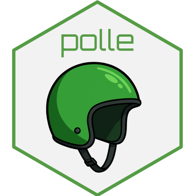

<!-- README.md is generated from README.Rmd. Please edit that file -->

<!-- badges: start -->

<!-- badges: end -->

# Policy Learning (`polle`) 

Package for evaluating user-specified finite stage policies and learning
optimal treatment policies via doubly robust loss functions. Policy
learning methods include doubly robust learning of the blip/conditional
average treatment effect and sequential policy tree learning. The
package also include methods for optimal subgroup analysis. See Nordland
and Holst (2026)
[doi:10.18637/jss.v116.i04](https://doi.org/10.18637/jss.v116.i04) for
documentation and references.
